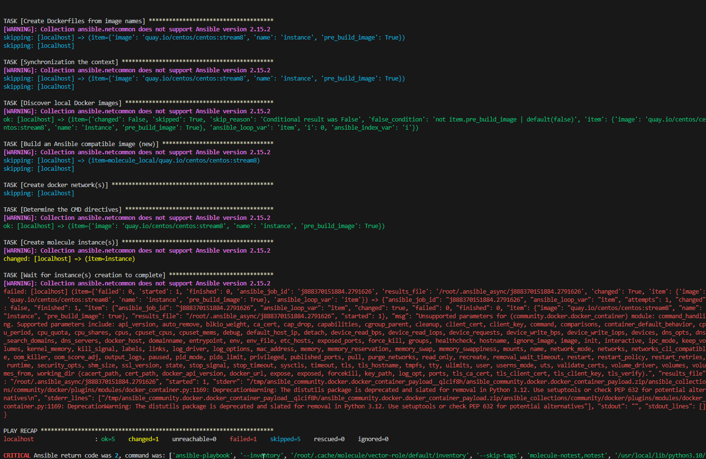

# Домашнее задание к занятию 5 «Тестирование roles»

## Подготовка к выполнению

1. Установите molecule: `pip3 install "molecule==3.5.2"`.
2. Выполните `docker pull aragast/netology:latest` —  это образ с podman, tox и несколькими пайтонами (3.7 и 3.9) внутри.

При установки molecule - система ругалась с ошибкой

```
ERROR: pip's dependency resolver does not currently take into account all the packages that are installed. This behaviour is the source of the following dependency conflicts.
molecule-podman 2.0.3 requires molecule>=4.0.0, but you have molecule 3.5.2 which is incompatible.
molecule-docker 2.1.0 requires molecule>=4.0.0, but you have molecule 3.5.2 which is incompatible.
```

переустановил docker , molecule-podman/docker , python. Причем если устанавливать через pip3 - выдает ошибку зависимостей. Через pip - все работает.

## Основная часть

Ваша цель — настроить тестирование ваших ролей. 

Задача — сделать сценарии тестирования для vector. 

Ожидаемый результат — все сценарии успешно проходят тестирование ролей.

### Molecule

1. Запустите  `molecule test -s centos_7` внутри корневой директории clickhouse-role, посмотрите на вывод команды. Данная команда может отработать с ошибками, это нормально. Наша цель - посмотреть как другие в реальном мире используют молекулу.
2. Перейдите в каталог с ролью vector-role и создайте сценарий тестирования по умолчанию при помощи `molecule init scenario --driver-name docker`.
3. Добавьте несколько разных дистрибутивов (centos:8, ubuntu:latest) для инстансов и протестируйте роль, исправьте найденные ошибки, если они есть.
```
Добавил папки: molecule/centos7 , molecule/centos8 , molecule/ubuntu:latest
были ошибки в meta/main.tf . Добавил несколько параметров и все заработало.
```
4. Добавьте несколько assert в verify.yml-файл для  проверки работоспособности vector-role (проверка, что конфиг валидный, проверка успешности запуска и др.). 

```
добавил три assert:
1. Проверка на существование файла vector.yml. Для настройки вектора используется именно vector.yml конфиг

    - name: check config vector.yml                    #имя задачи
      stat:                                            #проверка на существование файла
        path: /etc/vector/vector.yml                   #путь для проверки файла
      register: vector_file                            #заносим результат в переменную vector_file

    - name: assert file                                #имя задачи
      assert:                                          #Проверка
        that: vector_file.stat.exists                  #Если переменная vector_file существует то ошибки нет
        fail_msg: "File 'vector.yml ' not exist "      #Выводит сообщение если условие "that" прошло с ошибкой

2. Проверка запуска vector сервиса

    - name: start vector                                  #имя плея
      command: vector --config /etc/vector/vector.yml     #команда, которая будет запускать вектор 
      ignore_errors: true                                 #игнорируем ошибки
      register: output                                    #заносим вывод в переменную output
    - name: assert vector start                           #имя плея
      assert:                                             #Проверка
        that:                                             #условие
          - output.rc == 0                                #Если переменная будет равна 0 значит, что приложение запустилось
        fail_msg: "Vector not started"                    #Сообщение об ошибки в случае, если переменная output не равна 0

3. Проверка vector.yml файла используя утилиту yamllint


    - name: run yamllint for valid vector.yml     #имя задачи
      command: yamllint /etc/vector/vector.yml    #выполняем команду для валидации yml-файла
      register: result                            #заносим вывод в переменную
      ignore_errors: true                         #игнорируя ошибки

    - name: Errors in yaml file                   #имя задачи
      fail:                                       #создаем параметр для вывода ошибки
        msg: "vector.yml have errors"             #вывод ошибки если условие не верное
      when: result.rc != 0                        #если переменная result не равна 0 то задача fail будет выполнена и выводится сообщение об ошибке.
```
5. Запустите тестирование роли повторно и проверьте, что оно прошло успешно.

```
почему то выдает сдоровенную ошибку после переустановки python,docker,molecule.. \
Версии:

molecule 3.5.2 using python 3.10 
    ansible:2.15.2
    delegated:3.5.2 from molecule
    docker:2.1.0 from molecule_docker requiring collections: community.docker>=3.0.2 ansible.posix>=1.4.0
    podman:2.0.3 from molecule_podman requiring collections: containers.podman>=1.7.0 ansible.posix>=1.3.0

Docker version 24.0.4, build 3713ee1

Python 3.10.6

ansible [core 2.15.2]
  config file = None
  configured module search path = ['/root/.ansible/plugins/modules', '/usr/share/ansible/plugins/modules']
  ansible python module location = /usr/local/lib/python3.10/dist-packages/ansible
  ansible collection location = /root/.ansible/collections:/usr/share/ansible/collections
  executable location = /usr/local/bin/ansible
  python version = 3.10.6 (main, May 29 2023, 11:10:38) [GCC 11.3.0] (/usr/bin/python3)
  jinja version = 3.0.3
  libyaml = True


```
5. Добавьте новый тег на коммит с рабочим сценарием в соответствии с семантическим версионированием.

### Tox
```
pip3 install tox

```
1. Добавьте в директорию с vector-role файлы из [директории](./example).
2. Запустите `docker run --privileged=True -v <path_to_repo>:/opt/vector-role -w /opt/vector-role -it aragast/netology:latest /bin/bash`, где path_to_repo — путь до корня репозитория с vector-role на вашей файловой системе.
3. Внутри контейнера выполните команду `tox`, посмотрите на вывод.
```
[root@8a95a3d1e2ab vector-role]# tox
py37-ansible210 installed: ansible==2.10.7,ansible-base==2.10.17,ansible-compat==1.0.0,ansible-lint==5.1.3,arrow==1.2.3,bcrypt==4.0.1,binaryornot==0.4.4,bracex==2.3.post1,cached-property==1.5.2,Cerberus==1.3.2,certifi==2023.5.7,cffi==1.15.1,chardet==5.1.0,charset-normalizer==3.2.0,click==8.1.6,click-help-colors==0.9.1,cookiecutter==2.2.3,cryptography==41.0.2,distro==1.8.0,enrich==1.2.7,idna==3.4,importlib-metadata==6.7.0,Jinja2==3.1.2,jmespath==1.0.1,lxml==4.9.3,markdown-it-py==2.2.0,MarkupSafe==2.1.3,mdurl==0.1.2,molecule==3.5.2,molecule-podman==1.1.0,packaging==23.1,paramiko==2.12.0,pathspec==0.11.1,pluggy==1.2.0,pycparser==2.21,Pygments==2.15.1,PyNaCl==1.5.0,python-dateutil==2.8.2,python-slugify==8.0.1,PyYAML==5.4.1,requests==2.31.0,rich==13.4.2,ruamel.yaml==0.17.32,ruamel.yaml.clib==0.2.7,selinux==0.2.1,six==1.16.0,subprocess-tee==0.3.5,tenacity==8.2.2,text-unidecode==1.3,typing_extensions==4.7.1,urllib3==2.0.4,wcmatch==8.4.1,yamllint==1.26.3,zipp==3.15.0
py37-ansible210 run-test-pre: PYTHONHASHSEED='1623369902'
py37-ansible210 run-test: commands[0] | molecule test -s centos7 --destroy always
---
dependency:
  name: galaxy
driver:
  name: docker
lint: 'ansible-lint .

  yamllint .

  '
platforms:
  - image: ubuntu:latest
    name: instance
    pre_build_image: true
provisioner:
  name: ansible
verifier:
  name: ansible

CRITICAL Failed to pre-validate.

{'driver': [{'name': ['unallowed value docker']}]}
ERROR: InvocationError for command /opt/vector-role/.tox/py37-ansible210/bin/molecule test -s centos7 --destroy always (exited with code 1)
py37-ansible30 installed: ansible==3.0.0,ansible-base==2.10.17,ansible-compat==1.0.0,ansible-lint==5.1.3,arrow==1.2.3,bcrypt==4.0.1,binaryornot==0.4.4,bracex==2.3.post1,cached-property==1.5.2,Cerberus==1.3.2,certifi==2023.5.7,cffi==1.15.1,chardet==5.1.0,charset-normalizer==3.2.0,click==8.1.6,click-help-colors==0.9.1,cookiecutter==2.2.3,cryptography==41.0.2,distro==1.8.0,enrich==1.2.7,idna==3.4,importlib-metadata==6.7.0,Jinja2==3.1.2,jmespath==1.0.1,lxml==4.9.3,markdown-it-py==2.2.0,MarkupSafe==2.1.3,mdurl==0.1.2,molecule==3.5.2,molecule-podman==1.1.0,packaging==23.1,paramiko==2.12.0,pathspec==0.11.1,pluggy==1.2.0,pycparser==2.21,Pygments==2.15.1,PyNaCl==1.5.0,python-dateutil==2.8.2,python-slugify==8.0.1,PyYAML==5.4.1,requests==2.31.0,rich==13.4.2,ruamel.yaml==0.17.32,ruamel.yaml.clib==0.2.7,selinux==0.2.1,six==1.16.0,subprocess-tee==0.3.5,tenacity==8.2.2,text-unidecode==1.3,typing_extensions==4.7.1,urllib3==2.0.4,wcmatch==8.4.1,yamllint==1.26.3,zipp==3.15.0
py37-ansible30 run-test-pre: PYTHONHASHSEED='1623369902'
py37-ansible30 run-test: commands[0] | molecule test -s centos7 --destroy always
---
dependency:
  name: galaxy
driver:
  name: docker
lint: 'ansible-lint .

  yamllint .

  '
platforms:
  - image: ubuntu:latest
    name: instance
    pre_build_image: true
provisioner:
  name: ansible
verifier:
  name: ansible

CRITICAL Failed to pre-validate.

{'driver': [{'name': ['unallowed value docker']}]}
ERROR: InvocationError for command /opt/vector-role/.tox/py37-ansible30/bin/molecule test -s centos7 --destroy always (exited with code 1)
py39-ansible210 create: /opt/vector-role/.tox/py39-ansible210
ERROR: cowardly refusing to delete `envdir` (it does not look like a virtualenv): /opt/vector-role/.tox/py39-ansible210
____________________________________________________________________________________________________________ summary ____________________________________________________________________________________________________________
ERROR:   py37-ansible210: commands failed
ERROR:   py37-ansible30: commands failed
ERROR:   py39-ansible210: error
ERROR:   py39-ansible30: undefined

```

5. Создайте облегчённый сценарий для `molecule` с драйвером `molecule_podman`. Проверьте его на исполнимость.
```
Для начала устанавливаем molecule_podman
yum -y install podman

Далее добавляем в molecule.yml сценарий

scenario:
  test_sequence:
  - destroy
  - create                                                                                                                                         >
  - converge
  - destroy

```
6. Пропишите правильную команду в `tox.ini`, чтобы запускался облегчённый сценарий.

```
[tox]
minversion = 1.8
basepython = python3.6
envlist = py{37,39}-ansible{210,30}
skipsdist = true

[testenv]
passenv = *
deps =
    -r tox-requirements.txt
    ansible210: ansible<3.0
    ansible30: ansible<3.1
commands =
    {posargs:molecule test -s centos7 --destroy always}
```

8. Запустите команду `tox`. Убедитесь, что всё отработало успешно.

```

root@node1:/home/aloha/Desktop/devops-netology/mnt-homeworks-MNT-video/08-ansible-05-testing/ansible/vector-role# molecule matrix -s centos7 test
INFO     Test matrix
---                                                                                                                                                                                                                           
centos7:                                                                                                                                                                                                                         
  -destroy                                                                                                                                                                                                                      
  -create                                                                                                                                                                                                                   
  -converge                                                                                                                                                                                                                     
  -destroy    
```


9. Добавьте новый тег на коммит с рабочим сценарием в соответствии с семантическим версионированием.

После выполнения у вас должно получится два сценария molecule и один tox.ini файл в репозитории. Не забудьте указать в ответе теги решений Tox и Molecule заданий. В качестве решения пришлите ссылку на  ваш репозиторий и скриншоты этапов выполнения задания. 

## Необязательная часть

1. Проделайте схожие манипуляции для создания роли LightHouse.
2. Создайте сценарий внутри любой из своих ролей, который умеет поднимать весь стек при помощи всех ролей.
3. Убедитесь в работоспособности своего стека. Создайте отдельный verify.yml, который будет проверять работоспособность интеграции всех инструментов между ними.
4. Выложите свои roles в репозитории.

В качестве решения пришлите ссылки и скриншоты этапов выполнения задания.

---

### Как оформить решение задания

Выполненное домашнее задание пришлите в виде ссылки на .md-файл в вашем репозитории.

# Выполнение

molecule init scenario default --driver-name docker


