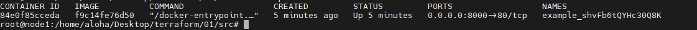
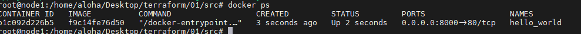

# Домашнее задание к занятию «Введение в Terraform»

### Цель задания

1. Установить и настроить Terrafrom.
2. Научиться использовать готовый код.

------

### Чеклист готовности к домашнему заданию

1. Скачайте и установите актуальную версию **terraform** >=1.4.0 . Приложите скриншот вывода команды ```terraform --version```.
2. Скачайте на свой ПК данный git репозиторий. Исходный код для выполнения задания расположен в директории **01/src**.
3. Убедитесь, что в вашей ОС установлен docker.


------

### Инструменты и дополнительные материалы, которые пригодятся для выполнения задания

1. Установка и настройка Terraform  [ссылка](https://cloud.yandex.ru/docs/tutorials/infrastructure-management/terraform-quickstart#from-yc-mirror)
2. Зеркало документации Terraform  [ссылка](https://registry.tfpla.net/browse/providers) 
3. Установка docker [ссылка](https://docs.docker.com/engine/install/ubuntu/) 
------

### Задание 1

1. Перейдите в каталог [**src**](https://github.com/netology-code/ter-homeworks/tree/main/01/src). Скачайте все необходимые зависимости, использованные в проекте. 
2. Изучите файл **.gitignore**. В каком terraform файле согласно этому .gitignore допустимо сохранить личную, секретную информацию?
```commandline
в файлах 
**/.terraform/* - вся папка будет игнорироваться
.terraform* - файлы начинающиеся с .terraform игнорятся
*.tfstate -  файлы заканчивающиеся на .tfstate 
*.tfstate.* -  файлы в которых есть .tfstate.
personal.auto.tfvars -  файл с точно таким же именем
```
3. Выполните код проекта. Найдите  в State-файле секретное содержимое созданного ресурса **random_password**, пришлите в качестве ответа конкретный ключ и его значение.
```
"result": "shvFb6tQYHc30Q8K",
```
4. Раскомментируйте блок кода, примерно расположенный на строчках 29-42 файла **main.tf**.
Выполните команду ```terraform validate```. Объясните в чем заключаются намеренно допущенные ошибки? Исправьте их.
```commandline

resource "docker_image" {             # указываем 2-ой лейбл
  name         = "nginx:latest"
  keep_locally = true
}

resource "docker_container" "1nginx" {             #убираем цифру вначале 2-го лейбла
  image = docker_image.nginx.image_id
  name  = "example_${random_password.random_string_fake.resuld}"  # подставляем правильную переменную 'random_password.random_string.result'

  ports {
    internal = 80
    external = 8000
  }
}

```
5. Выполните код. В качестве ответа приложите вывод команды ``docker ps`` \
 


6. Замените имя docker-контейнера в блоке кода на ```hello_world```, выполните команду ```terraform apply -auto-approve```.
Объясните своими словами, в чем может быть опасность применения ключа  ```-auto-approve``` ? В качестве ответа дополнительно приложите вывод команды ```docker ps```

```
-auto-approve - позволяет пропустить интерактив , что в свою очередь пропускает ручную проверку и запускает. По сути это автоподтверждение 
```
7. Уничтожьте созданные ресурсы с помощью **terraform**. Убедитесь, что все ресурсы удалены. Приложите содержимое файла **terraform.tfstate**. 
```commandline

{
  "version": 4,
  "terraform_version": "1.4.6",
  "serial": 19,
  "lineage": "5ea9a173-eebb-2bcf-10e3-7ea5cd9fa935",
  "outputs": {},
  "resources": [],
  "check_results": null
}


```
8. Объясните, почему при этом не был удален docker образ **nginx:latest** ? Ответ подкрепите выдержкой из документации провайдера.

Насоклько я понимаю, дело в команде ``keep_locally = true`` которая оставляет образ . \
https://registry.tfpla.net/providers/kreuzwerker/docker/latest/docs/resources/image

## Дополнительные задания (со звездочкой*)

**Настоятельно рекомендуем выполнять все задания под звёздочкой.**   Их выполнение поможет глубже разобраться в материале.   
Задания под звёздочкой дополнительные (необязательные к выполнению) и никак не повлияют на получение вами зачета по этому домашнему заданию. 

### Задание 2*

1. Изучите в документации provider [**Virtualbox**](https://registry.tfpla.net/providers/shekeriev/virtualbox/latest/docs/overview/index) от 
shekeriev.
2. Создайте с его помощью любую виртуальную машину. Чтобы не использовать VPN советуем выбрать любой образ с расположением в github из [**списка**](https://www.vagrantbox.es/)

В качестве ответа приложите plan для создаваемого ресурса и скриншот созданного в VB ресурса.  \
 \

 \

```
terraform {
  required_providers {
    virtualbox = {
      source = "shekeriev/virtualbox"
      version = "0.0.4"
    }
  }
}

provider "virtualbox" {
  delay      = 60
  mintimeout = 5
}

resource "virtualbox_vm" "vm1" {
  name   = "centos-7.2.box"
  image  = "https://github.com/CommanderK5/packer-centos-template/releases/download/0.7.2/vagrant-centos-7.2.box"
  cpus      = 1
  memory    = "512 mib"

  network_adapter {
    type           = "internal"
    host_interface = "wlp2s0"
 }
}

```


------

### Правила приема работы

Домашняя работа оформляется в отдельном GitHub репозитории в файле README.md.   
Выполненное домашнее задание пришлите ссылкой на .md-файл в вашем репозитории.

### Критерии оценки

Зачёт:

* выполнены все задания;
* ответы даны в развёрнутой форме;
* приложены соответствующие скриншоты и файлы проекта;
* в выполненных заданиях нет противоречий и нарушения логики.

На доработку:

* задание выполнено частично или не выполнено вообще;
* в логике выполнения заданий есть противоречия и существенные недостатки. 
