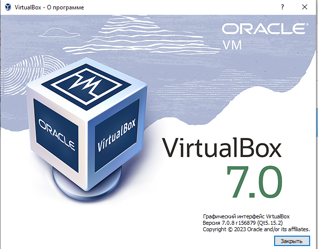
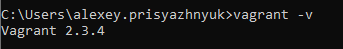
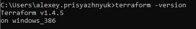
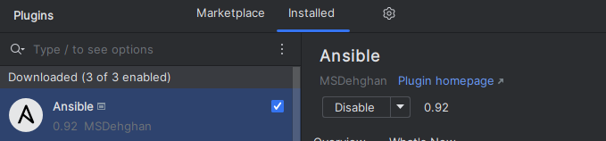

## Задача 1

- Опишите основные преимущества применения на практике IaaC-паттернов.

		Надежность версий. При создании ос мы используем один и тот же образ или шаблон
    	Скорость. Мы можем создавать машины из шаблонов. 

    
- Какой из принципов IaaC является основополагающим?


    	идемпотентность - тоесть принцип с помощью которого мы получаем один и тот же результат при повторном  выполнении .

## Задача 2

- Чем Ansible выгодно отличается от других систем управление конфигурациями?


    	Для работы ansible не нужен агент. Прост в изучении по отношению к аналогам. 
- Какой, на ваш взгляд, метод работы систем конфигурации более надёжный — push или pull?
 

   	 	Pull - т.к. хосты будут обращаться к заранее заданному хосту для получения инструкций. Но и pull думаю тоже весьма надежна т.к. соединения можно настроить с помощью ключей. 

## Задача 3

Установите на личный компьютер:

- [VirtualBox](https://www.virtualbox.org/),
- [Vagrant](https://github.com/netology-code/devops-materials),
- [Terraform](https://github.com/netology-code/devops-materials/blob/master/README.md),
- Ansible.

*Приложите вывод команд установленных версий каждой из программ, оформленный в Markdown.*

- на Windows:
---

---

---

---

---

## Задача 4 

Воспроизведите практическую часть лекции самостоятельно.

- Создайте виртуальную машину.
- Зайдите внутрь ВМ, убедитесь, что Docker установлен с помощью команды
```
docker ps,
```
Vagrantfile из лекции и код ansible находятся в [папке](https://github.com/netology-code/virt-homeworks/tree/virt-11/05-virt-02-iaac/src).

Примечание. Если Vagrant выдаёт ошибку:
```
URL: ["https://vagrantcloud.com/bento/ubuntu-20.04"]     
Error: The requested URL returned error: 404:
```

выполните следующие действия:

1. Скачайте с [сайта](https://app.vagrantup.com/bento/boxes/ubuntu-20.04) файл-образ "bento/ubuntu-20.04".
2. Добавьте его в список образов Vagrant: "vagrant box add bento/ubuntu-20.04 <путь к файлу>".


